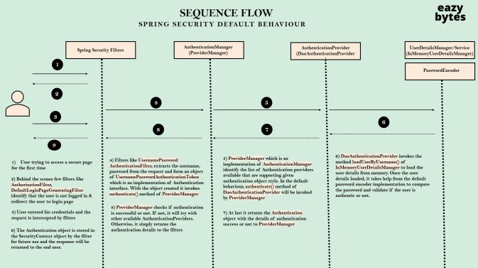

# Spring Security Filter Order

1. AuthorizationFilter
   - 엔드 유저가 접근하고자 하는 URL 에 접근 제한한다.
2. DefaultLoginPageGeneratingFilter
   - 기본 로그인 페이지를 생성한다.
3. UsernamePasswordAuthenticationFilter
   - http로부터 유저 네임과 패스워드를 추출한다.
   - UsernamePasswordAuthenticationToken 객체 생성
- UsernamePasswordAuthenticationToken 은 Authentication 의 구현체이다.
4. ProviderManager 는 AuthenticationManager 의 구현
   - 인증 성공이나 실패를 확인할 때까지 반복
5. DaoAuthenticationProvider
   - AuthenticationProvider 는 유저가 어떻게 인증되어야 하는지에 대한 로직을 정의한다.
   - AbstractUserDetailsAuthenticationProvider 의 구현체
   - AbstractUserDetailsAuthenticationProvider 의 authenticate 에 ProviderManager는 요청을 전송.
   - UserDetailsManager 의 구현체 중 하나로부터 UserDetails 객체를 가져온다.
   - PasswordEncoder 를 사용하여 UserDetails 객체의 패스워드를 비교한다.
6. InMemoryUserDetailsManager
   - UserDetailsManager 의 구현체
   - UserDetails 객체를 메모리에 저장한다.
   - loadUserByUsername 메소드를 구현한다.

